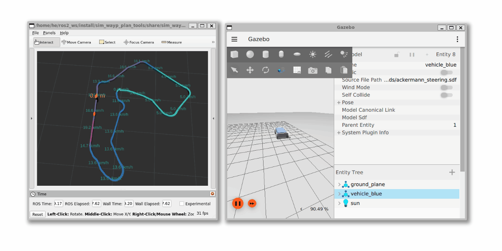

# ROS 2 `sim_wayp_plan_tools` package
Gazebo Fortress ROS 2 simulation for the waypoint and planner tools.





# Requirements
- ROS 2 Humble: [docs.ros.org/en/humble/Installation.html](https://docs.ros.org/en/humble/Installation.html)
- Gazebo Fortress: [gazebosim.org/docs/fortress/install_ubuntu](https://gazebosim.org/docs/fortress/install_ubuntu), read more about integration: [gazebosim.org/docs/fortress/ros2_integration](https://gazebosim.org/docs/fortress/ros2_integration)

## Packages and build

It is assumed that the workspace is `~/ros2_ws/`.

### Clone the packages
```
cd ~/ros2_ws/src
git clone https://github.com/jkk-research/wayp_plan_tools
git clone https://github.com/jkk-research/sim-wayp_plan_tools
```

### Build ROS 2 packages
```
cd ~/ros2_ws
colcon build --packages-select wayp_plan_tools sim-wayp_plan_tools
```


# Usage of `wayp_plan_tools` as a simulation

## 1. Start the simulation
```
ign gazebo -v 4 -r ackermann_steering.sdf
```

## 2. Start the Gazebo bridge

Don't forget to `source` before ROS commands.

``` r
source ~/ros2_ws/install/local_setup.bash
```

``` r
ros2 launch sim_wayp_plan_tools gazebo_bridge.launch.py
```

In the background this `launch` file starts nodes similar to:

``` r
ros2 run ros_gz_bridge parameter_bridge /world/ackermann_steering/pose/info@geometry_msgs/msg/PoseArray[ignition.msgs.Pose_V
ros2 run ros_gz_bridge parameter_bridge /model/vehicle_blue/cmd_vel@geometry_msgs/msg/Twist]ignition.msgs.Twist
ros2 run ros_gz_bridge parameter_bridge /model/vehicle_blue/odometry@nav_msgs/msg/Odometry[ignition.msgs.Odometry --ros-args -r /model/vehicle_blue/odometry:=/odom
```
More about the bridge here: [github.com/gazebosim/ros_gz/blob/ros2/ros_gz_bridge/README.md](https://github.com/gazebosim/ros_gz/blob/ros2/ros_gz_bridge/README.md)

Also this `launch` creates `/tf` from the `PoseArray` with `pose_arr_to_tf`.

## *Optional*: teleoperation via keyboard

``` r
ros2 run teleop_twist_keyboard teleop_twist_keyboard --ros-args -r /cmd_vel:=/model/vehicle_blue/cmd_vel
```

## 3. Load waypoints 

Use you ROS 2 workspace as `file_dir`:
``` r
ros2 run wayp_plan_tools waypoint_loader --ros-args -p file_name:=sim_waypoints1.csv -p file_dir:=/home/he/ros2_ws/src/sim_wayp_plan_tools/csv
```
Or simply with default parameters:

``` r
ros2 launch sim_wayp_plan_tools waypoint_loader.launch.py
```

## 4. Waypoint to target

``` r
ros2 run wayp_plan_tools waypoint_to_target --ros-args -p lookahead_min:=2.5 -p lookahead_max:=4.5 -p mps_alpha:=1.5 -p mps_beta:=3.5 -p waypoint_topic:=sim1/waypointarray
```
Or simply with default parameters:

``` r
ros2 launch sim_wayp_plan_tools waypoint_to_target.launch.py
```

## 5. Start a control

There are some options:
- `single_goal_pursuit`: Pure pursuit (for vehicles / robots), a simple cross-track error method
- `multiple_goal_pursuit`: Multiple goal pursuit for vehicles / robots an implementation of our [paper](https://hjic.mk.uni-pannon.hu/index.php/hjic/article/view/914)
- `stanley_control`: Stanley controller, a heading error + cross-track error method
- `follow_the_carrot`: Follow-the-carrot, the simplest controller

This is a pure pursuit example:

``` r
ros2 run wayp_plan_tools single_goal_pursuit --ros-args -p cmd_topic:=sim1/cmd_vel -p wheelbase:=2.789 -p waypoint_topic:=sim1/targetpoints
```
Or simply with default parameters:

``` r
ros2 launch sim_wayp_plan_tools single_goal_pursuit.launch.py
```

## 6. Visualize results in `RViz2`
``` r
ros2 launch sim_wayp_plan_tools rviz1.launch.py
```


