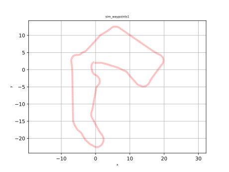
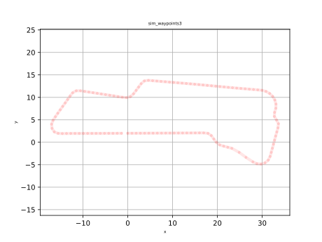

# `sim_waypoints1.csv`

# `sim_waypoints2.csv`

A [Hungaroring](https://en.wikipedia.org/wiki/Hungaroring) inspired track.

# `sim_waypoints3.csv`

# `sim_waypoints4.csv`

A real-word measurement at the [ZalaZone](https://zalazone.hu/en/) Automotive Proving Ground, University track.

# Evaluation example

